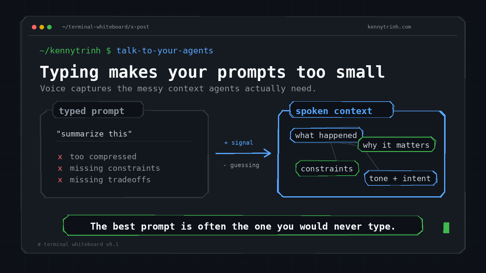

# terminal-whiteboard

Generate rough terminal-style whiteboard visuals for technical posts, docs, and explainers.

The default look is a **dark terminal whiteboard**: mono typography, rough boxes/arrows, GitHub-ish dark colors, and compact labels that read well on X.



## Why

Most AI-generated social visuals look glossy, generic, or illegible. `terminal-whiteboard` is meant for builder-native visuals that feel closer to a sketch in a terminal than a Canva template.

## Install for development

This project uses [`uv`](https://docs.astral.sh/uv/), not pip.

```bash
uv sync --dev
```

## Usage

Render the built-in sample:

```bash
uv run terminal-whiteboard sample --output examples/talk-to-your-agents.png
```

Render a custom contrast visual:

```bash
uv run terminal-whiteboard contrast \
  --title "Typing makes your prompts too small" \
  --subtitle "Voice captures the messy context agents actually need." \
  --left-label "typed prompt" \
  --left-title '"summarize this"' \
  --left-bullet "too compressed" \
  --left-bullet "missing constraints" \
  --left-bullet "missing tradeoffs" \
  --right-label "spoken context" \
  --right-node "what happened" \
  --right-node "why it matters" \
  --right-node "constraints" \
  --right-node "tone + intent" \
  --arrow-top "+ signal" \
  --arrow-bottom "- guessing" \
  --takeaway "The best prompt is often the one you would never type." \
  --watermark "kennytrinh.com" \
  --output outputs/custom.png
```

## Development

```bash
uv run pytest
uv run ruff check .
uv run terminal-whiteboard sample --output /tmp/talk-to-your-agents.png
```

## Design principles

- dark terminal surface
- mono-first typography
- rough hand-drawn shapes, not glossy AI art
- blue/green accents, red only for negative marks
- one idea per visual
- short labels over paragraph text
- watermark is quiet, not logo-heavy

## Status

Early alpha. The first template is a two-card contrast visual. Planned templates:

- flow diagrams
- stacked frameworks
- quote cards
- node maps
- Excalidraw/SVG export
